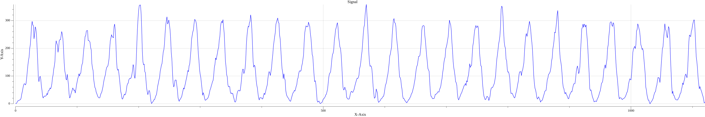
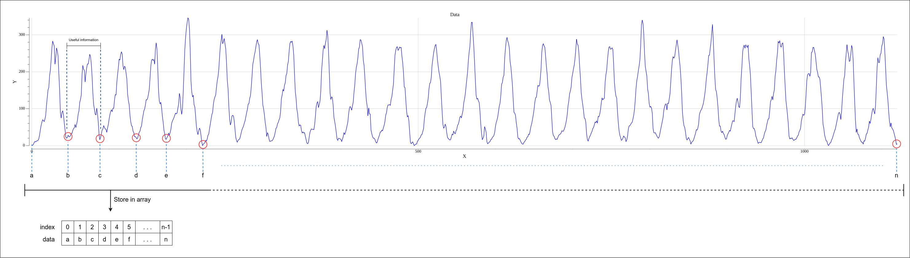
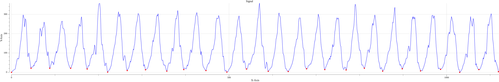

# Non-Linear Segmentation Signal
A distress signal is being broadcasted to your location from nearby area. However, interference on atmosphere causing distortion to the original transmitted signal which makes the receiving signal is hard to decode.


# Contents
1. [Problem Statement](#problem-statement)
2. [Input Format](#input-format)
3. [Output Format](#output-format)
4. [Run](#run)

# Problem Statement
In order to decode the receiving signal, you must extract useful information by finding segmentation coordinate and store it in array. The segmentation coordinate is the local minima value between useful information signal. You don't have to find the exact lowest local minima point as long as it's within actual nearest neighbor local minima point is acceptable.


# Input Format
* The first line of input contains an unsigned integer ***t*** denoting the number of signal's data.
* Each of the next ***t*** contains two space-separated unsigned integer ***x*** and ***y*** represent a 2D cartesian coordinate system of input signal.

**Sample Input**:
```bash
31
0 0
1 0
2 0
3 0
4 0
5 0
6 1
7 2
8 3
9 3
10 4
11 6
12 3
13 2
14 9
15 8
16 9
17 5
18 4
19 7
20 7
21 5
22 5
23 4
24 6
25 8
26 16
27 15
28 21
29 30
30 46
```

## Output Format
The output format will be an array of struct [Segment](coordinate/coordinate.go) which represents list of segmentation coordinate to extract the useful information from signal based on the problem statement.

**Sample Output**:
```bash
[{0 0} {30 21} {60 21} {90 21} {120 17} {150 1} {180 9} {210 13} {240 6} {270 14} {300 9} {330 1}]
```

## Output Graph


## Run
Please ensure current work directory is the root of directory of this git repository and execute following make file script command on your terminal.

Where `SIGNAL` argument is input signal filename on [dataset](dataset/) directory.
```bash
/non-linear-graph-segmentation$ make run SIGNAL=signal1
```